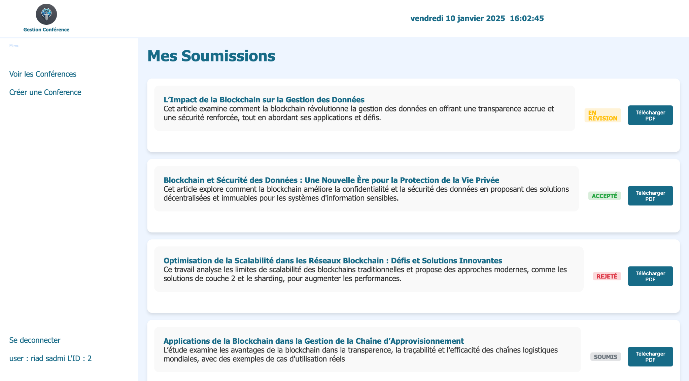
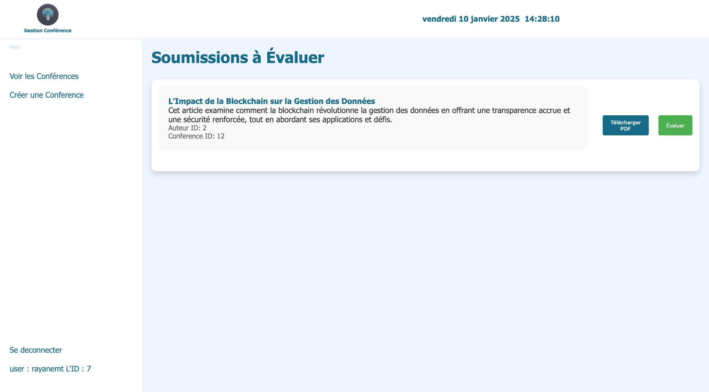
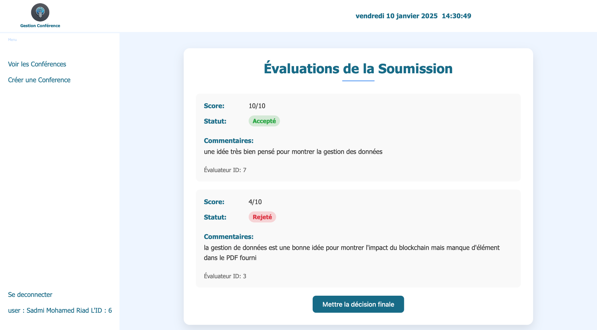
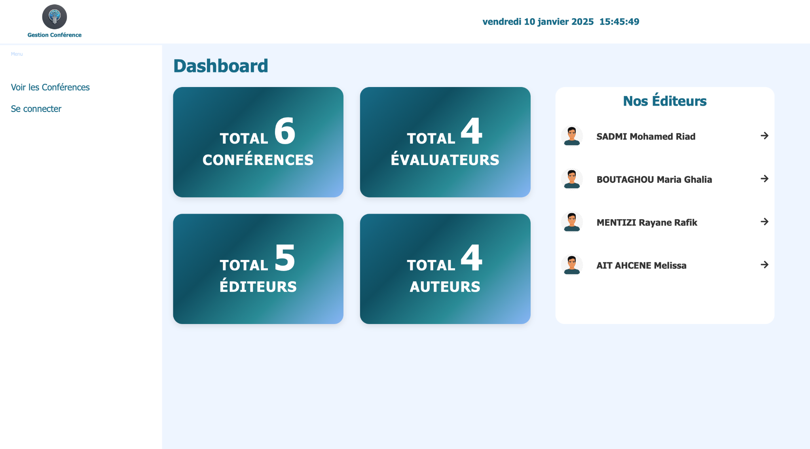

# Conference Management Web Application

A front‑to‑back solution that streamlines the academic‑conference workflow:
Call‑for‑papers → Submission → Peer Review → Editorial Decision → Publication.

> **Front‑end** and **Back‑end** live in **two distinct repositories**.  
> This README only covers the **React front‑end**; the Spring Boot back‑end (H2 database) is documented in its own repo.

<p align="center">
  
</p>

---

## ✨  Key Features

| Role | Capabilities | Screenshot |
|------|--------------|------------|
| **Public / Guest** | Browse upcoming conferences, filter by status, view dates & descriptions. | — |
| **Author** | Upload papers (PDF), track status (Submitted → In Review → Accepted / Rejected). |  |
| **Reviewer** | Personal queue, download PDF, submit score, verdict & comments. |  |
| **Editor** | Create conferences, open/close CFP, assign reviewers, see aggregated reviews, set final decision. |  |
| **Admin** | Dashboard with KPIs (conferences, reviewers, editors, authors) and editor directory. |  |

Additional screenshots live in `/public/screenshots/`.

---

## 🏗  Tech Stack

| Layer | Technology |
|-------|------------|
| Front‑end | **React + Vite**, TypeScript, React‑Router |
| Back‑end* | **Spring Boot 3** (Java 17), H2 in‑memory database |
| Database | **H2** (in‑memory) |

\* See the **backend repository** for API endpoints, data model and environment variables.

---

## 🚀  Getting Started (Front‑end)

### 1. Clone & bootstrap

```bash
git clone https://github.com/your‑org/conference‑management-frontend.git
cd conference‑management-frontend
```

### 2. Install & run

```bash
npm install
npm run dev     # SPA on http://localhost:5173
```

> **Tip**: Extract `conference_app_screenshots.zip` into `public/screenshots/`  
> so the images in this README display correctly.

---

## 🔗  Connecting to the API

The front‑end expects the back‑end to be running at:

```
http://localhost:8080
```

If you changed the server port or context path, update the proxy value in `vite.config.ts`:

```ts
// vite.config.ts
export default defineConfig({
  server: {
    proxy: {
      '/api': 'http://localhost:8080'
    }
  }
});
```

---

## 🧪  Testing

```bash
npm run test    # Jest + React Testing Library
```

---

## 🙌  Contributing

1. Fork ➜ `git checkout -b feat/awesome`  
2. Commit with **conventional commits**  
3. `git push` & open a Pull Request

Please update screenshots and documentation if the UI changes.

---

## 📄  License

Distributed under the **MIT License** – see [`LICENSE`](LICENSE) for details.
